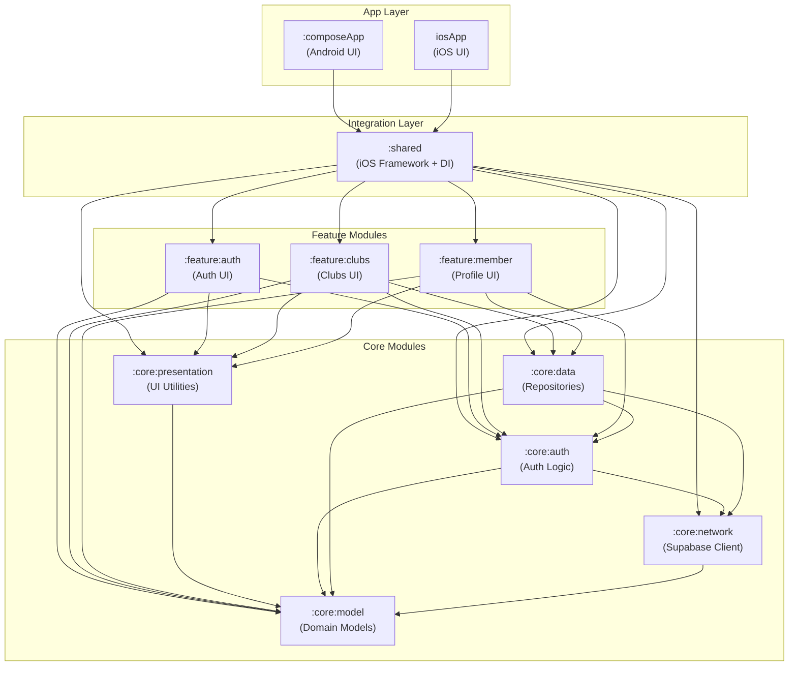

# Module Dependency Graph

This document visualizes the Gradle module dependency structure for Kluvs.

## Overview



## Dependency Flow

### Vertical Layers

```
┌─────────────────────────────────────────────┐
│              App Layer                       │
│         (composeApp, iosApp)                │
└─────────────────┬───────────────────────────┘
                  │
┌─────────────────▼───────────────────────────┐
│           Integration Layer                  │
│              (shared)                        │
└─────────────────┬───────────────────────────┘
                  │
┌─────────────────▼───────────────────────────┐
│           Feature Layer                      │
│   (feature:auth, feature:clubs,             │
│            feature:member)                   │
└─────────────────┬───────────────────────────┘
                  │
┌─────────────────▼───────────────────────────┐
│             Core Layer                       │
│  (core:presentation, core:auth, core:data)  │
└─────────────────┬───────────────────────────┘
                  │
┌─────────────────▼───────────────────────────┐
│          Foundation Layer                    │
│      (core:network, core:model)             │
└─────────────────────────────────────────────┘
```

## Module Descriptions

| Module | Type | Purpose |
|--------|------|---------|
| `:composeApp` | App | Android application with Compose UI |
| `iosApp` | App | iOS application (Xcode project) |
| `:shared` | Integration | iOS framework export + DI setup |
| `:feature:auth` | Feature | Authentication screens |
| `:feature:clubs` | Feature | Club details and sessions |
| `:feature:member` | Feature | User profile and stats |
| `:core:presentation` | Core | Shared UI utilities |
| `:core:auth` | Core | Authentication business logic |
| `:core:data` | Core | Repository pattern implementation |
| `:core:network` | Core | Supabase client configuration |
| `:core:model` | Core | Domain model definitions |

## Dependency Rules

1. **App modules** only depend on `:shared`
2. **Feature modules** depend on core modules, never on each other
3. **Core modules** can depend on other core modules at the same or lower level
4. **`:core:model`** has no internal dependencies (leaf module)
5. **`:shared`** aggregates all modules for iOS framework export

## API vs Implementation

- `api()` - Exposes types transitively (used for public APIs)
- `implementation()` - Internal dependency (encapsulated)

### Feature Module Pattern

```kotlin
// feature:clubs/build.gradle.kts
commonMain.dependencies {
    api(project(":core:model"))           // Exposed: UI models use domain types
    implementation(project(":core:data")) // Internal: repository usage
    implementation(project(":core:auth")) // Internal: auth checks
    implementation(project(":core:presentation")) // Internal: formatting
}
```
